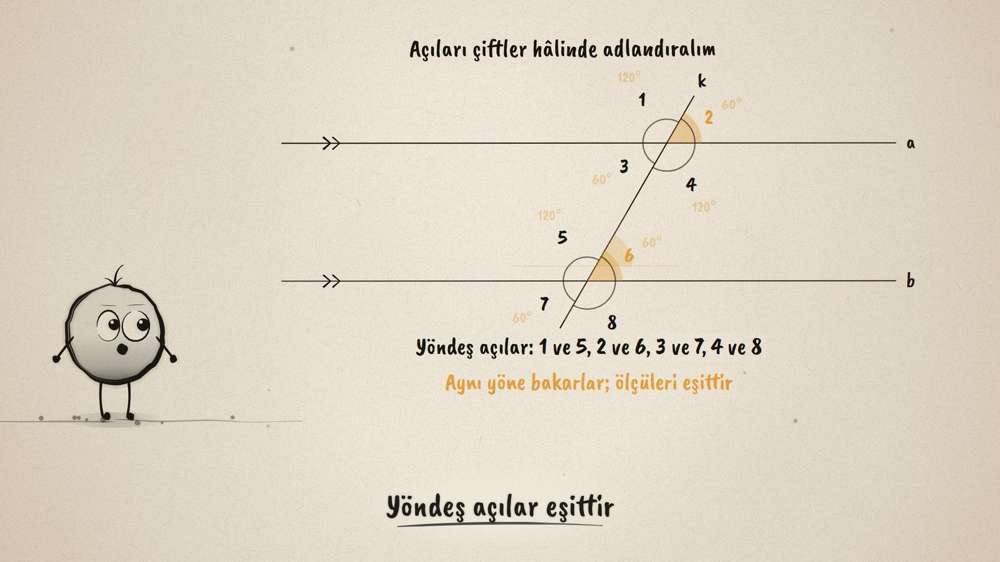
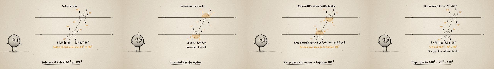

# Kesen Doğru · Parallel Lines and a Transversal

**▶ Tarayıcıda izleyin / Watch in the browser:** https://hakanatas.github.io/kesen-dogru/ 
**⬇ MP4 + altyazılar / MP4 + subtitles:** [Releases](https://github.com/hakanatas/kesen-dogru/releases) 
**✎ Kullanılan istem / The prompt behind it:** [PROMPT.md](PROMPT.md) 
**🎞 Bütün filmler / All films:** [Nokta'nın Filmleri](https://hakanatas.github.io/nokta-filmleri/?sinif=6)

> **TR —** 6. sınıf matematik "Geometrik Şekiller" temasındaki MAT.6.3.1 öğrenme çıktısı için hazırlanmış, tamamen JavaScript ile çizilen 92 saniyelik mürekkep animasyonu. a ve b paralel doğrularını k keseni kesiyor; iki kesişim noktasında 8 açı oluşuyor ve numaralanıyor. Ölçülünce yalnızca iki farklı ölçü çıkıyor: 60° ve 120°. Açılar ayrıştırılıyor: paralellerin arasındakiler iç açılar, dışındakiler dış açılar. Sonra çiftler hâlinde sınıflandırılıp adlandırılıyor: üstteki kesişim alttakinin üzerine kaydırılınca yöndeş açıların eşitliği görünüyor; iç ters ve dış ters açılar eşit, karşı durumlu açıların toplamı 180°. Son olarak kesen döndürülüp bir açı 70° yapılıyor: diğerleri 70° ve 110°. Altyazılar Türkçe, İngilizce ya da ikisi birlikte seçilebilir.

A 92-second ink animation for **6th-grade maths**, the first film of the third 6th-grade theme. Nokta, the ink character from [The Learning Ink](https://github.com/hakanatas/the-learning-ink), is the guide again. The whole figure is computed from one number, the transversal's angle (`geom` and `angles` in `src/draw/film.js`), so turning the transversal from 60° to 70° updates every arc and every measure at once.

## Learning outcome

MEB, Türkiye Yüzyılı Maarif Modeli, Ortaokul Matematik, 6th grade, "Geometrik Şekiller" theme:

**MAT.6.3.1. Düzlemde iki paralel doğru ve bir kesen ile oluşan açıları sınıflandırabilme**
- a) Düzlemde iki paralel doğru ve bir kesen ile oluşan açıları belirler.
- b) Düzlemde iki paralel doğru ve bir kesen ile oluşan açıları ayrıştırır.
- c) Düzlemde iki paralel doğru ve bir kesen ile oluşan açıları tasnif eder.
- ç) Bu tasnife göre açıları adlandırır.

## Scenes

| # | Time | Scene | What happens | Outcome |
|---|---|---|---|---|
| 1 | 0–10 s | Paraleller ve kesen | Parallel lines a and b, a transversal k. | a |
| 2 | 10–28 s | Sekiz açı | Eight numbered angles; measured, they are only 60° and 120°. | a |
| 3 | 28–46 s | İç ve dış | Interior angles 3, 4, 5, 6 between the parallels; exterior 1, 2, 7, 8. | b |
| 4 | 46–70 s | Adlandırma | Corresponding (slide one crossing onto the other), alternate interior, alternate exterior: equal. Same-side: 180°. | c, ç |
| 5 | 70–80 s | Bir açıdan hepsine | Turn k so one angle is 70°: four angles 70°, four 110°. | c, ç |
| 6 | 80–92 s | Aklında kalsın | Equal pairs, 180° pairs, two measures in all. | ç |

## Running it

- **Preview:** double-click `index.html` (it works offline).
- **MP4:** run `npm install` once, then `npm run export -- --format=horizontal --captions=tr`.
- **Subtitles and narration:** `npm run srt` writes `out/captions_*.srt` and `narration_notes.txt`.
- **Editing:**
  - Caption text, timings and narration notes: `captions.js`
  - Everything on screen is drawn by `LI.world(t)` in `scenes/scene1.js` (the figure, which pairs glow when in `GROUPS`, the words); the other scenes only set the camera.
  - The geometry of the lines and the eight angles, and Nokta's poses: `src/draw/film.js`; layout for 16:9 and 9:16: `src/draw/kd.js`

It uses the same engine as The Learning Ink: `renderFrame(t)` as a pure function of time, seeded randomness, and frame-by-frame export.
